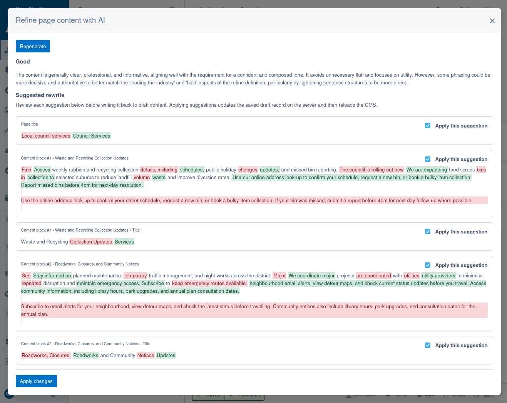

# AI Refine module for Silverstripe CMS

A Silverstripe CMS 6 module that lets users define a corporate content style guide and uses AI to evaluate whether page content adheres to it. The module analyses each page against the style guide and surfaces compliance status and recommendations in the CMS.



The background job and the on-demand modal intentionally use the same rewrite-aware evaluation prompt. The background job discards `suggestions` and stores only rating and reasoning, but keeping rewrite in the prompt produces stronger audit judgements than a cheaper score-only prompt. In the CMS, editors can review those structured suggestions and apply selected ones back to Draft content before the page reloads.

## Installation

This module is hosted on a private GitHub repository and is not listed on Packagist. To install it, add the following to your project's `composer.json`:

```json
{
    "repositories": [
        {
            "type": "vcs",
            "url": "git@github.com:silverstripeltd/silverstripe-ai-refine.git"
        }
    ],
    // ...
    "require": {
        "silverstripeltd/ai-refine": "dev-main"
    }
}
```

## Development

When working on this module, AI tools (e.g. Claude Code, Copilot) should be run from the **project root**, not from within this directory. The module's `CLAUDE.md` should be symlinked to the project root so that AI tools pick it up automatically:

```bash
cd path/to/project

if [ -f CLAUDE.md ] || [ -L CLAUDE.md ]; then rm -f CLAUDE.md; fi
ln -s vendor/silverstripeltd/ai-refine/CLAUDE.md CLAUDE.md
```

`CLAUDE.md` contains the project identity, hard constraints, directory structure, and the module-specific testing, spec-editing, and command conventions in one place so the AI does not have to discover separate skill files at runtime.

Note that `CLAUDE.md` contains instructions for a specific Docker setup - you will probably need to update that file to match your local, standardised environment.

### Running tests and linting

From the project root:

- PHP unit tests:
  - `ssh webserver "cd /var/www && rm -rf /tmp/pu-cache && mkdir -p /tmp/pu-cache && SS_TEMP_PATH=/tmp/pu-cache nice -n 19 ionice -c 3 taskset -c 0 vendor/bin/phpunit vendor/silverstripeltd/ai-refine/tests/ --fail-on-warning"`
- PHP linting:
  - `ssh webserver "cd /var/www/vendor/silverstripeltd/ai-refine && nice -n 19 ionice -c 3 taskset -c 0 ../../bin/phpcs --ignore=*/thirdparty/*,*/node_modules/* --extensions=php ."`
- JS linting:
  - `ssh webserver "cd /var/www/vendor/silverstripeltd/ai-refine && NODE_OPTIONS=--max-old-space-size=512 nice -n 19 ionice -c 3 taskset -c 0 yarn lint"`
- JS build:
  - `ssh webserver "cd /var/www/vendor/silverstripeltd/ai-refine/client && NODE_OPTIONS=--max-old-space-size=512 nice -n 19 ionice -c 3 taskset -c 0 yarn install && NODE_OPTIONS=--max-old-space-size=512 nice -n 19 ionice -c 3 taskset -c 0 yarn build"`

## Configuration

All configuration is via environment variables (e.g. in your webserver env or `.env`). Restart your webserver after changing any values.

### Provider

Set the AI provider and API key. Gemini, OpenAI, and Anthropic are supported out of the box. Custom providers can be added by extending `AbstractAIProvider`.

```bash
AI_REFINE_PROVIDER=gemini              # gemini (default), openai, or anthropic
AI_REFINE_API_KEY=your-api-key         # API key for the chosen provider
```

### Model

Control which model is used and how it generates responses. All optional - sensible defaults are used if omitted.

```bash
AI_REFINE_MODEL=gemini-3.1-flash-lite  # Model identifier (provider-specific)
AI_REFINE_THINKING_LEVEL=low           # Thinking effort: none, low, medium, or high
AI_REFINE_TEMPERATURE=0.0              # Sampling temperature (0.0–1.0)
AI_REFINE_MAX_TOKENS=20000             # Max tokens in AI response
AI_REFINE_REQUEST_TIMEOUT=15           # Timeout per AI request in seconds
```

`AI_REFINE_TEMPERATURE` defaults to `0.0` on purpose. This module is primarily an auditing and compliance tool, so repeatable ratings are preferred over creative variation or reroll-style behaviour. If a project wants looser, more exploratory responses, it can still override the value explicitly.

`AI_REFINE_MAX_TOKENS` defaults to a higher value because both the background job and the on-demand modal use the same rewrite-aware prompt. That costs more tokens, but it is a deliberate tradeoff because omitting rewrite changes the model's audit behaviour and makes the results weaker.

### Queued jobs

The `GenerateAiRefineJob` processes pages in batches. These settings control rate limiting and scheduling.

```bash
AI_REFINE_RATE_LIMIT_DELAY=6           # Min seconds between API request starts (see below)
AI_REFINE_JOB_BATCH_SIZE=50            # Max pages processed per job run
AI_REFINE_JOB_REQUEUE_DELAY=28800      # Seconds before scheduling next run (default: 8 hours)
```

The rate limit delay is measured from the **start** of each API request, not from when it finishes. If a request takes longer than the delay, the next request starts immediately with no extra wait.

## Supported content

Refine evaluates and rewrites text-based fields on the page and its Elemental content blocks. Specifically, it supports:

- **TextField** fields (`Varchar` database type)
- **TextareaField** fields (`Text` database type)
- **HTMLEditorField** (WYSIWYG) fields (`HTMLText`, `HTMLVarchar` database types)
- **Page Title and Content** fields

Other field types (e.g. dropdowns, dates, checkboxes) and titles or content on related objects (e.g. a linked Banner's heading) are not included in the analysis or rewrite suggestions.

## Usage

### SiteConfig dependency

Refine depends on `SiteConfig.RefineDefinition`. Editors configure this in **Settings > Refine**, and both the background job and the on-demand modal use that same definition as the source of truth.

If the definition is empty:

- the background job skips all pages
- the CMS report shows a setup banner instead of compliance data
- the toolbar button still opens the modal so editors see the missing-configuration guidance instead of a silently missing action

### On-demand workflow

The on-demand workflow is a review-and-apply modal aimed at CMS editors working on a specific page:

1. Open the page in the CMS and click **Refine** in the preview toolbar.
2. Click **Rewrite for refine** to evaluate the page's saved Draft content against the configured refine.
3. Review the returned rating, reasoning summary, and per-target diff cards.
4. Select only the suggestions you want to accept.
5. Click **Apply changes** to write those changes back to Draft content.

The modal does not edit suggestion text inline and does not persist on-demand results to `RefineAnalysis`. Instead, it acts as a focused review surface for applying selected rewrites to the current page draft.

### Draft and Live behaviour

This module intentionally uses different content for different workflows:

- **Page editing** reads `Draft` content so editors can review and improve unpublished changes before publishing. Apply writes selected suggestions back to `Draft` only and never publishes.
- **Queued job and CMS report** are based on published `Live` content. The queued job skips draft-only pages and stores ratings for the public version of the site. The report displays those stored ratings but compares them against the current `Draft` content hash, so unpublished edits can mark a page as out of date even when the stored rating came from `Live`.

This split is intentional: site owners get a report about what is currently published, while editors get an on-demand tool for improving what they are about to publish.

## CMS report

The **Refine compliance** report gives website owners and CMS administrators a worst-first overview of how published content aligns with the configured refine.

- Ratings and reasoning come from the background job's Live-content analysis.
- The **Analysis status** column compares that stored analysis against the page's current CMS content hash, so draft edits can show a row as **Out of date** before anything is published.
- If no refine has been configured in Site Settings, the report shows an informational setup banner instead of the table.

Together, the report and modal cover two different jobs: the report audits the published site, while the modal supports page-by-page editorial review and application on Draft.
